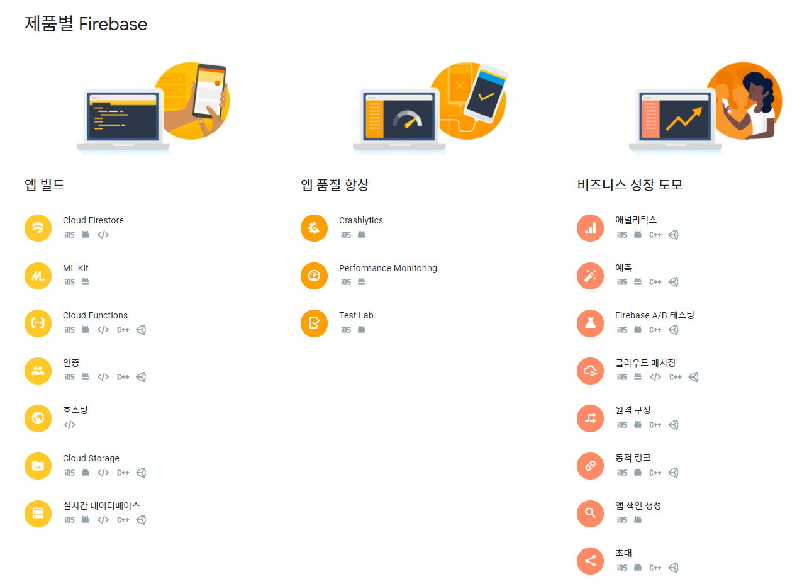
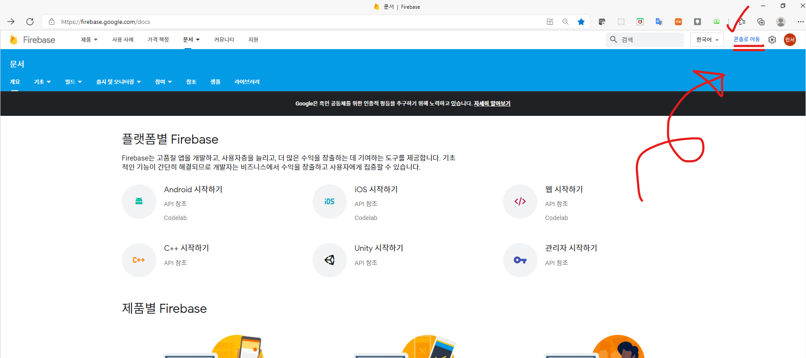
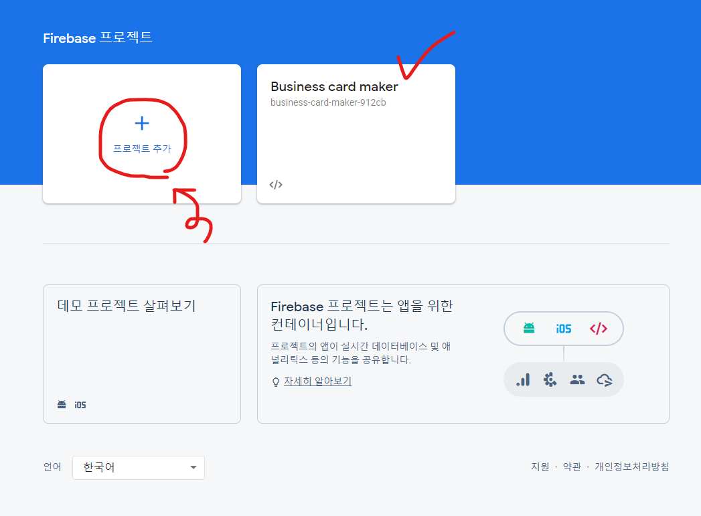
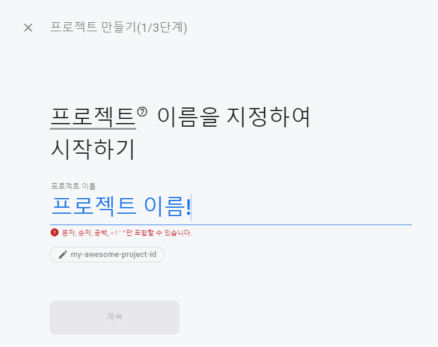
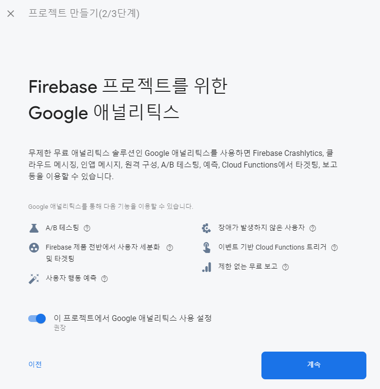
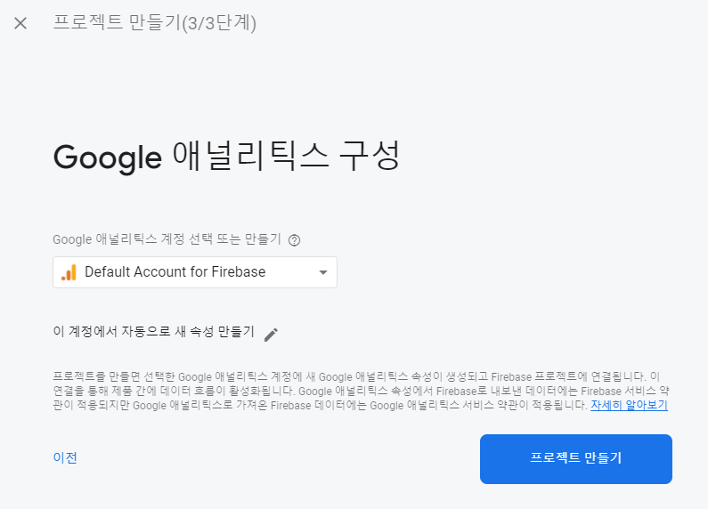
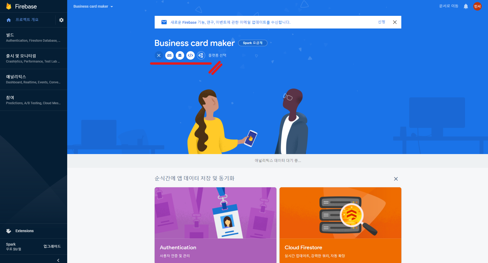
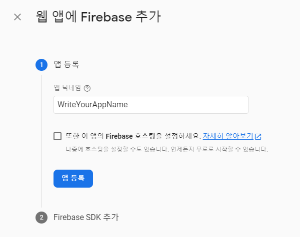
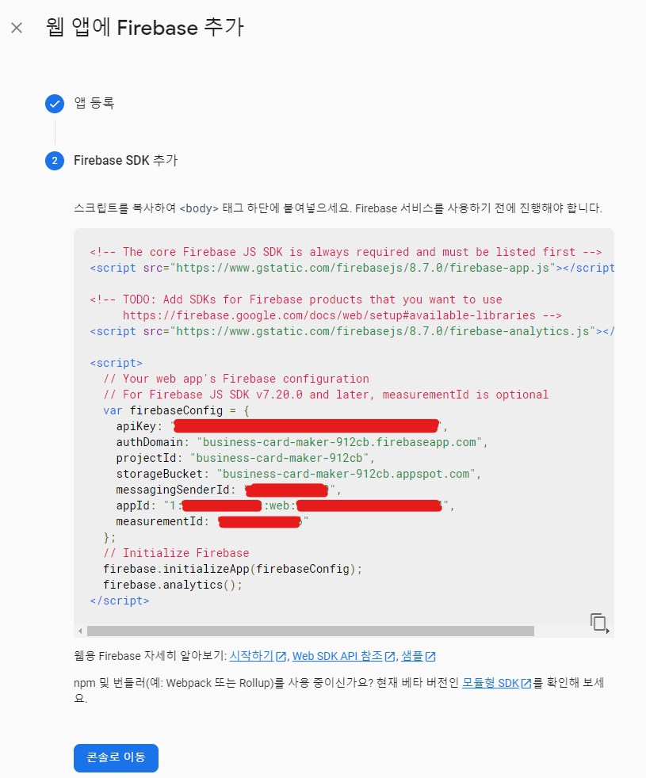

# Firebase

[firebase.google.com](https://firebase.google.com/)

위의 이미지처럼 파이어베이스는 굉장히 많은 기능을 제공하고 있다.

## 기능별 소개
- **Build better Apps 앱 빌드**
  - [Cloud Firestore](https://firebase.google.com/docs/firestore)
  - [Firebase용 ML Kit](https://firebase.google.com/docs/ml-kit)
  - [Cloud Functions](https://firebase.google.com/docs/functions)
  - [Authentication 인증](https://firebase.google.com/docs/auth)
  - [Hosting 호스팅](https://firebase.google.com/docs/hosting)
  - [Cloud Storage](https://firebase.google.com/docs/storage)
  - [Realtime Database 실시간 데이터베이스](https://firebase.google.com/docs/database)
- **Improve app quality 앱 품질 향상**
  - [Crashlytics](https://firebase.google.com/docs/crashlytics)
  - [Performance Monitoring](https://firebase.google.com/docs/perf-mon)
  - [Test Lab](https://firebase.google.com/docs/test-lab)
- **Grow your business 비지니스 성장 도모**
  - [Google Analytics 애널리틱스](https://firebase.google.com/docs/analytics)
  - [Predictions 예측](https://firebase.google.com/docs/predictions)
  - [Firebase A/B 테스팅](https://firebase.google.com/docs/ab-testing)
  - [Cloud Messaging 클라우드 메시징](https://firebase.google.com/docs/cloud-messaging)
  - [Remote Config 원격 구성](https://firebase.google.com/docs/remote-config)
  - [Dynamic Links 동적 링크](https://firebase.google.com/docs/dynamic-links)
  - [Firebase App Indexing 앱 색인 생성](https://firebase.google.com/docs/app-indexing)
  - 초대 (아직 미시행 중인듯(docs 404 error))

## Create New Project

일단 위의 이미지에서 보여주듯이 <U>로그인 후</U> 우측 상단에 콘솔로 이동 버튼을 클릭하거나 
https://console.firebase.google.com/ 주소를 통해 파이어베이스 콘솔에 접근한다.

파이어베이스 콘솔에 접근후 "프로젝트 추가" 를 클릭해서 새로운 프로젝트를 개설한다. 
새로운 프로젝트를 개설하게되면 위의 이미지처럼 생성된 프로젝트가 보인다.

"프로젝트 추가"를 클릭하고 나서 프로젝트 이름을 지정해준다. 위의 그림은 예시일 뿐 파이어베이스에서 요구하는 형식에 맞게 이름을 지정해주고 계속/Continue을 클릭해주면 된다.

계속/Continue

프로젝트 만들기 -> 프로젝트 생성 완료

## 어플리케이션 등록

새로 생성한 프로젝트의 메인콘솔로 접근하게 되면 위의 이미지처럼 화면이 나오는데  
프로젝트 이름 하단에 어플리케이션을 등록할 수 있는 부분이 있다. 그 중 원하는 어플리케이션을 클릭해주면 된다. 앱개발이면 `IOS` 또는 `Android`, 웹개발이면 `</>` 을 클릭해준다.  
나는 웹 어플리케이션을 만들거기 때문에 `</>`을 클릭해주겠다.

원하는 어플리케이션을 추가 클릭해주면 위의 이미지와 같은 화면이 나온다.  
앱 이름을 작성해주고, 파이어베이스 호스팅을 원한다면 체크박스를 체크해주고 아니면 체크하지 않은 상태에서 앱 등록을 클릭해준다.

등록을 하게 되면 필요한 SDK 스크립트 코드를 보여준다.  
이러한 SDK 스크립트 코드를 현재 개발하려고 하는 어플리케이션에 추가하고 SDK에서 제공하는 API 함수들을 사용하면 된다.